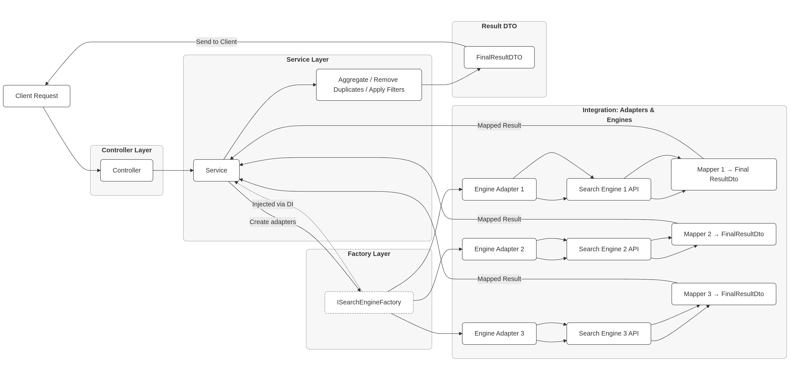

# Literature Search Workflow

## 1. Client Request
Everything starts with a **Client Request**. This represents an HTTP request sent by a client web application to the API.

## 2. Controller Layer
The client request is received by the **Controller** in the **Controller Layer**.  
The Controller is the API's entry point and is responsible for:
- Receiving requests;
- Delegating the request to the service layer.

## 3. Service Layer
The Controller calls the **Service** within the **Service Layer**, which contains the main business logic of the application.  

The Service has the following responsibilities:

- The Service uses the **Factory Layer** (specifically, the `ISearchEngineFactory`) to create instances of **Engine Adapters** and invoke them. This is done via **Dependency Injection (DI)**, making the system more flexible and testable, and allowing different adapter implementations to be injected as needed.
- Validating input data.

## 4. Integration: Adapters & Engines
This layer handles the API’s interaction with external systems (search engines).

### 4.1 Engine Adapters
Each **Engine Adapter** (Engine Adapter 1, Engine Adapter 2, Engine Adapter 3) encapsulates the logic for communicating with a specific search engine:
- Constructs the query for each search engine
- Formats the request header for the **Search Engine API**;
- Sends the request;
- Receives the response.

### 4.2 Search Engine API
Each **Engine Adapter** interacts with its respective **Search Engine API** (Search Engine 1, 2, 3), which provides the raw data.

### 4.3 Mappers
After receiving the response from the **Search Engine API**, each **Engine Adapter** passes the data to a corresponding **Mapper** (Mapper 1, Mapper 2, Mapper 3).  
Mappers are responsible for transforming the raw data from each search engine into a common format, called the **Mapped Result**, which is returned to the Service.

## 5. Returning to the Service Layer
The Service receives the **Mapped Results** from all invoked Engine Adapters.

## 6. Processing in the Service Layer
With all **Mapped Results** in hand, the Service performs the following operations:
- **Aggregate:** Combines results from all sources;
- **Remove Duplicates:** Eliminates identical or highly similar results from different search engines;
- **Apply Filters:** Applies filtering criteria specified in the client request (e.g., sort by price, filter by category).

## 7. Result DTO
After processing (aggregation, deduplication, and filtering), the data is formatted into a **FinalResultDTO**, representing the standardized and consolidated response to be sent back to the client.

## 8. Send to Client
The **FinalResultDTO** is sent back to the client as the API’s final response.
