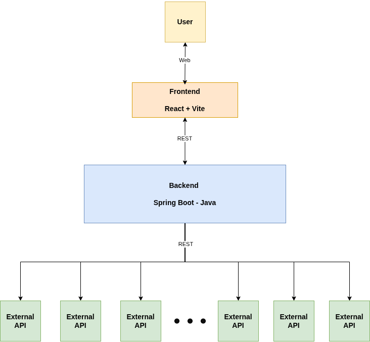
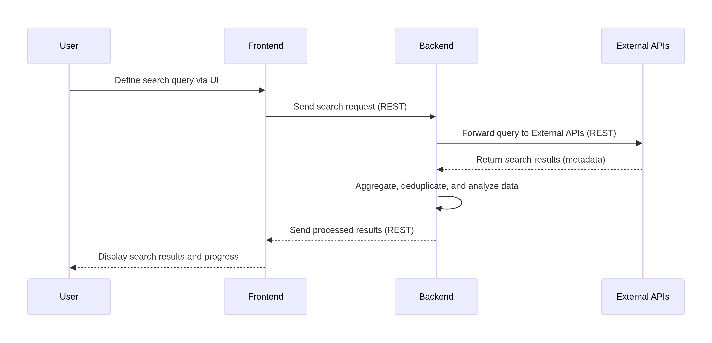

# Architecture Overview

Our web application is designed to facilitate systematic literature reviews by providing a user-friendly interface to search across various academic databases (External APIs) and manage the review process. The architecture is composed of a decoupled frontend and backend, interacting with external data sources.

## Components and Their Functions

### 1. User
- **Role:** The end-user interacting with the web application through a browser.  
- **Purpose:** Perform systematic literature reviews (SLRs), manage search queries, and view results.

---

### 2. Frontend (React + Vite)
- **User Interface (UI):** Provides an intuitive and responsive interface for defining search queries, viewing results, managing literature, and tracking review progress.  
- **User Interaction:** Handles all user inputs, navigation, and displays data retrieved from the Backend.  
- **Data Presentation:** Formats and presents search results and review progress in a digestible, user-friendly manner.  
- **Local Storage Management:** Uses the browser's local storage to persist UI state and session-specific data that needs to survive page reloads, without requiring a backend database. This includes temporary search queries, user preferences, and review progress that can be stored client-side.

---

### 3. Backend (Spring Boot - Java)
- **API Gateway:** Central point of contact for the Frontend, exposing a RESTful API.  
- **Business Logic:** Core functionalities for systematic reviews, including:  
  - Parsing and validating user search queries  
  - Orchestrating calls to multiple External APIs  
  - Aggregating and deduplicating results from various sources  
  - Filtering, sorting, and analyzing retrieved data  
- **External API Integration:** Handles connections, authentication, and requests to academic databases (e.g., Scopus, IEEE), acting as a proxy for external data retrieval.  
- **Security:** Handles authentication, authorization, and data protection for external API interactions.
  
**Note:** Without a database, user sessions and review progress are managed client-side or through temporary session storage.  

---

### 4. External APIs (e.g., Scopus, IEEE)
- **Data Sources:** Third-party online libraries and academic databases providing access to scholarly articles, journals, and conferences.  
- **Search Capabilities:** Offer programmatic search options based on keywords, authors, publication dates, and other criteria.  
- **Metadata Retrieval:** Return metadata about publications, which serve as the primary source of all retrievable data for the application.

---

## Technology Stack Justification

### Frontend: React + Vite
- **React:**  
  - Declarative and component-based JavaScript library for building complex, interactive UIs  
  - Efficient Virtual DOM ensures smooth UI updates  
  - Popular and well-supported, with a large ecosystem  

- **Vite:**  
  - Fast development server and optimized build process  
  - Instant hot module replacement (HMR) enables rapid iteration  
  - Simplifies development cycles for dynamic UI workflows

---

### Backend: Spring Boot - Java
- **Spring Boot:**  
  - Production-ready, scalable Java framework  
  - "Convention over configuration" reduces setup and development time  
  - Leverages the Spring ecosystem (data access, web services, Spring Security)  

- **Scalability & Performance:**  
  - Handles large search queries and results from multiple external APIs  
  - Stateless design simplifies horizontal scaling  

- **Maintainability:**  
  - Strong typing and modular design enable maintainable and testable code  
  - Suitable for integrating with multiple external systems and processing large datasets  

- **Concurrency:**  
  - Orchestrates multiple parallel API calls efficiently  
  - Prevents blocking of the main application flow, improving responsiveness

 

# Sequence Diagram: Literature Search Request Flow

The following sequence describes how a user interacts with the web application to perform a literature search. Communication between all system components, except the user, occurs via REST APIs.

## Explanation of the Sequence

1. **User Interaction**  
   The process begins when the **User** enters a search query in the browser interface. This includes parameters such as keywords, authors, publication years, or filtering criteria.

2. **Frontend Request (React + Vite)**  
   The **Frontend** application, built with React and Vite, captures the user input and sends a **REST request** to the backend.  
   This request typically includes the query parameters and optional user preferences.

3. **Backend Processing (Spring Boot - Java)**  
   The **Backend** receives the REST request and performs several operations:
   - **Validation:** Ensures the search query is correctly structured.  
   - **Orchestration:** Dispatches multiple REST calls to various **External APIs** (e.g., Scopus, IEEE).  
   - **Aggregation:** Collects and merges results from all sources.  
   - **Deduplication:** Removes overlapping entries.  
   - **Analysis:** Applies filters, sorting, or additional data enrichment.

4. **External API Communication**  
   The **External APIs** return metadata about the matched publications (e.g., titles, authors, abstracts, DOIs, publication sources).  
   Each response may vary slightly depending on the API’s data format and limitations.

5. **Response to Frontend**  
   After processing the data, the backend sends the **aggregated and cleaned results** back to the frontend through a REST response.

6. **Frontend Data Handling & Presentation**  
   The **Frontend** receives the processed results and:
   - Formats the data for display in the user interface.  
   - Optionally stores session or search configuration in **local storage**, ensuring continuity even if the page is reloaded.  
   - Updates the UI to show the user the retrieved articles, progress, and filters.

7. **User Review and Interaction**  
   Finally, the **User** views, explores, and refines the results. They may adjust filters or initiate a new search.
